<div align="center">



<sub><i>build things at the point where software meets music — and let people see them.</i></sub>

</div>

<br>

## `$ cat about.md`

Final-year **Information Systems and Technologies** student at **Bilkent University**,
spending the summer building in the gap between code and sound. I play guitar,
violin, ukulele and piano, learn most things by ear, and I am slowly teaching myself
how to point that same ear at signal processing and ML.

Most of what is below was built to fix something that was annoying me — an ERP form,
a slow test suite, a cover video I could not get to sound right — not to fill a
portfolio.

```
> os          Bilkent University · IST · 2022 – 2027
> exchange    Metropolia UAS, Finland · Erasmus, Aug – Dec 2025
> gpa         3.80 / 4.00
> based_in    Ankara, Türkiye
```

<br>

## `$ ls -la ./interests`

```
drwxr-xr-x   music/              guitar · violin · ukulele · piano — learned by ear,
                                  which means my covers end up arranged, not copied
drwxr-xr-x   music+tech/         sound as data — audio signal processing & ML for
                                  music, taught mostly outside a syllabus
drwxr-xr-x   creative-coding/    small games & graphics (OpenGL / GLUT) — the
                                  interactive, visual side of building
```

<br>

## `$ git log --oneline --experience`

**`Software Development Intern`** — Bilişim A.Ş. (ERP Development) · Ankara · Jan – May 2026
```
+ built frontend & backend features on a Java-based ERP system
+ stack: Java, Oracle DB, REST APIs, Maven, Tomcat
+ improved GUI layouts, added business validations, tightened data integrity
+ migrated SOAP services to REST, tested with Postman & Swagger
+ worked DAO architecture, SQL, Git, enterprise dev workflows
```

**`Software Testing Intern`** — TRT · Ankara · Jun – Jul 2025
```
+ API & load testing with Postman, Insomnia, k6
+ end-to-end / UI automation with Cypress and Selenium (Java)
+ first real exposure to QA as a discipline, not just a step before shipping
```

<br>

## `$ cat stack.json`

**languages**
<p>
  
  
  
  
  
  
  
</p>

**music & audio**
<p>
  
  
  
  
</p>

**testing**
<p>
  
  
  
  
  
</p>

**tools & environments**
<p>
  
  
  
  
  
  
  
</p>

**graphics**
<p>
  
  
</p>

<br>

## `$ ./stats.sh --render`

<div align="center">


<br>

</div>

<br>

## `$ mail --to dilara`

<p align="center">
  
  
</p>

<div align="center">
<sub>$ echo "publish over polish" ▋</sub>
</div>
