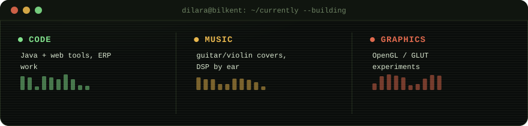

<div align="center">


</div>

<br>

## `$ cat about.md`

Final-year **Information Systems and Technologies** student at **Bilkent University**,
spending the summer building in the gap between code and sound. I play guitar,
violin, ukulele and piano, learn most things by ear.

```
> university   Bilkent University
> department   Information Systems and Technologies
> exchange     Metropolia UAS, Finland · Erasmus, Aug – Dec 2025
> gpa          3.80 / 4.00
> based_in     Ankara, Türkiye
```

<br>

## `$ ls -la ./interests`

```
drwxr-xr-x   music/              guitar · violin · ukulele · piano 
drwxr-xr-x   music+tech/         sound as data — audio signal processing & ML for
                                  music
drwxr-xr-x   creative-coding/    small games & graphics (OpenGL / GLUT)
```

<br>

## `$ git log --oneline --experience`

**`Software Development Intern`** — Bilişim A.Ş. (ERP Development) · Ankara · Jan – May 2026
```
+ built frontend & backend features on a Java-based ERP system
+ stack: Java, Oracle DB, REST APIs, Maven, Tomcat
+ improved GUI layouts, added business validations, tightened data integrity
+ migrated SOAP services to REST, tested with Postman & Swagger
+ worked DAO architecture, SQL, Git, enterprise dev workflows
```

**`Software Testing Intern`** — TRT · Ankara · Jun – Jul 2025
```
+ API & load testing with Postman, Insomnia, k6
+ end-to-end / UI automation with Cypress and Selenium (Java)
```

<br>

## `$ cat stack.json`

**languages**
<p>
  
  
  
  
  
  
  
</p>

**music & audio**
<p>
  
  
  
  
</p>

**testing**
<p>
  
  
  
  
  
</p>

**tools & environments**
<p>
  
  
  
  
  
  
  
</p>

**graphics**
<p>
  
  
</p>

<br>

## `$ ./skills.sh --bars`

<div align="center">

</div>

<br>

## `$ ls -la ./currently --building`

<div align="center">

</div>


<br>

## `$ ./activity.sh --graph`

<div align="center">

</div>

<br>

## `$ mail --to dilara`

<p align="center">
  
  
</p>

<div align="center">
<sub>$ ▋</sub>
</div>
